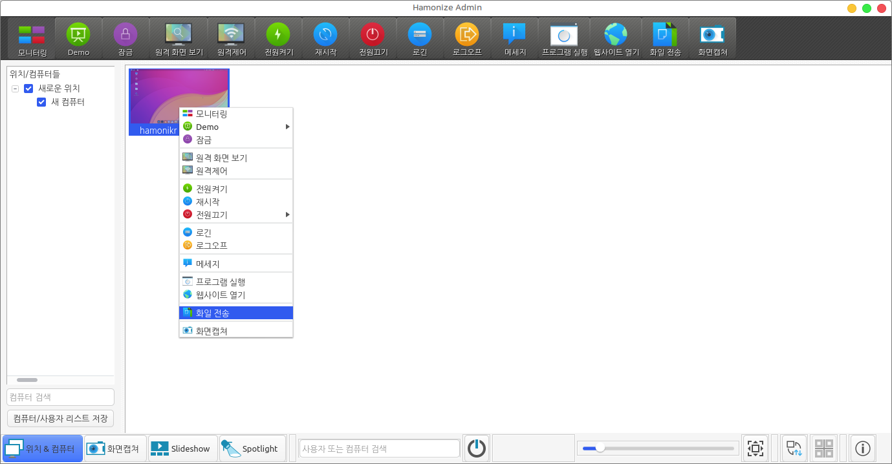

# hamonize-admin


## Hamonize-admin?

하모나이즈 어드민은 원격지 PC들을 관리하기 위한 원격 지원 및 모니터링을 할 수 있는 솔루션입니다.

<br>


## 사용법


<br>

 자세한 내용은 [사용자 매뉴얼](http://team.hamonikr.org:18090/pages/viewpage.action?pageId=2458819) 을 참고하세요


<br>

## 빌드하기

### 소스 다운로드

먼저 깃 저장소를 복제하고 모든 서브모듈을 가져와야 합니다.

```
git clone --recursive https://github.com/hamonikr/hamonize.git
cd hamonize/hamonize-admin

or

git clone https://github.com/hamonikr/hamonize.git
cd hamonize
git submodule init
git submodule update
```
<br>

### 빌드에 필요한 패키지 설치

데비안 기반의 빌드 환경에 필요한 의존성입니다:
- Build tools: g++ make cmake
- Qt5: qtbase5-dev qtbase5-dev-tools qttools5-dev qttools5-dev-tools
- X11: xorg-dev libxtst-dev
- libjpeg: libjpeg-dev provided by libjpeg-turbo8-dev or libjpeg62-turbo-dev
- zlib: zlib1g-dev
- OpenSSL: libssl-dev
- PAM: libpam0g-dev
- procps: libprocps-dev
- LZO: liblzo2-dev
- QCA: libqca2-dev or libqca-qt5-2-dev
- LDAP: libldap2-dev
- SASL: libsasl2-dev

root 에서 실행해주세요
```
apt install g++ make cmake qtbase5-dev qtbase5-dev-tools qttools5-dev qttools5-dev-tools libqca-qt5-2-plugins xorg-dev libxtst-dev libjpeg-dev zlib1g-dev libssl-dev libpam0g-dev libprocps-dev liblzo2-dev libqca-qt5-2-dev libldap2-dev libsasl2-dev
```
<br>

### 빌드 설정과 소스 빌드

#### 유저버전 빌드

hamonize-admin 의 유저버전인 hamonize-user를 빌드하고자 한다면 다음 명령어 수행 후 어드민 빌드를 시작하세요.
```
cd hamonize-admin
mv postinst postinst_admin && mv postinst_user postinst
mv CMakeLists.txt CMakeLists_admin.txt && mv CMakeLists_user.txt CMakeLists.txt
mv cmake/CPackDefinitions.cmake cmake/CPackDefinitions_admin.cmake && mv cmake/CPackDefinitions_user.cmake cmake/CPackDefinitions.cmake
```

#### 어드민 빌드

다음 커맨드에 따라 실행해주세요
```
mkdir build
cd build
cmake ..
make -j4
```

참고: 제공된 cmake 방식 대신 데비안(.deb) 패키지를 생성하려면 다음을 사용해야 합니다.
```
cmake -DCMAKE_INSTALL_PREFIX=/usr ..
```
/usr/local이 아닌 /usr에 패키지 파일을 설치합니다.

일부 요구 사항이 충족되지 않으면 CMAKE에서 이를 알려고주고 계속하기 전에 누락된 소프트웨어를 설치해야 합니다.

이제 현재 시스템에 따라 패키지를 생성할 수 있습니다.

패키지를 생성하기 위해서는 다음을 실행해주세요.
```
fakeroot make package
```

그러면 hamonize_x.y.z_amd64.deb 패키지를 얻을 수 있습니다.

패키지를 설치하기 위해서는 다음을 실행해주세요.
```
sudo dpkg -i hamonize_x.y.z_amd64.deb
```

데몬을 다시 실행해 주세요.
```
sudo systemctl daemon-reload
```

또는 빌드된 바이너리를 직접 설치할 수 있습니다.(권장하지 않습니다.)
바이너리로 설치하려면 다음을 실행해주세요.
```
make install
```

#### 어드민 빌드 for Windows

Windows 실행파일을 빌드하기 위한 Cross compiling 방법입니다.

아래 명령어를 통해 Windows 빌드 환경이 구축된 Docker 이미지를 내려받고 컨테이너에 접속합니다.
```
docker pull yeji0407/admin_win:1.0
docker run -it yeji0407/admin_win:1.0 bash
```
아래 명령어를 통해 하모나이즈 소스코드를 내려받습니다.

```
git clone --recursive https://github.com/hamonikr/hamonize.git
```

하모나이즈 어드민의 빌드를 수행할 위치로 이동합니다.

```
mkdir /tmp/build-64 && cd /tmp/build-64
```

아래 명령어를 통해 빌드합니다.

```
cmake /hamonize/hamonize-admin/ -DCMAKE_TOOLCHAIN_FILE=/hamonize/hamonize-admin/cmake/modules/Win64Toolchain.cmake -DCMAKE_MODULE_PATH=/hamonize/hamonize-admin/cmake/modules/

make windows-binaries

cd hamonize-win64-[version]

makeinsis hamonize.nsi
```
현재 위치한 경로에 생성된 hamonize-[version]-win64-setup.exe 실행파일을 Windows에서 다운로드 받고 실행합니다. 

<br>

## License

Copyright (c) 2004-2021 Invesume Inc / Tobias Junghans / Veyon Solutions

See the file COPYING for the GNU GENERAL PUBLIC LICENSE.

<br>

### Debugging

참고: 제공된 cmake 명령 대신 이 소프트웨어를 개발하기 위한 디버깅 모드를 구축하려면 다음을 사용해야 합니다.  
디버깅 모드를 구축합니다.
```
cmake -DCMAKE_BUILD_TYPE=Debug <path and other arguments>
```

<br>

### 참여하기
* #### :sparkles: [issues](https://github.com/hamonikr/hamonize/issues?q=+is%3Aissue+milestone%3A%22%EC%9B%90%EA%B2%A9%EA%B4%80%EB%A6%AC+%ED%94%84%EB%A1%9C%EA%B7%B8%EB%9E%A8+%EA%B0%9C%EB%B0%9C%22+)

*  Code Style
    <br>hamonize-admin 프로젝트는 [Google C++ Style Guide](https://google.github.io/styleguide/cppguide.html) 를 준수하고 있습니다.<br>
개발환경에 맞게 코드 스타일을 적용해주세요.<br> 아래는 예시입니다.
    - vscode : setting.json 파일에 아래의 내용을 추가해주세요 
      ```
        "C_Cpp.clang_format_fallbackStyle": "Google"
        "editor.formatOnSave": true  // 소스 저장시 바로 코드스타일 적용되는 옵션 
        ...
      ```
    - visual studio code : Tools > Options > Text Editor > C/C++ > "Google" 선택
  


<br>

## More information

* https://github.com/hamonikr/hamonize
* https://hamonikr.org
* https://veyon.io/
