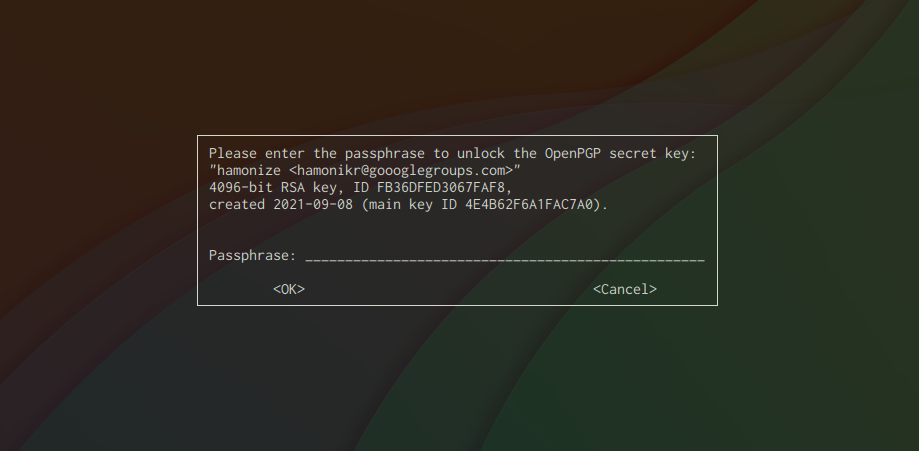

# Hamonize-APT
하모나이즈 서비스를 운용하는데 필요한 패키지를 설치하거나 업데이트하는데 사용되는 apt저장소입니다. <br>
도커 이미지로 제공하고 있으니 아래의 명령어로 간단히 개별 apt 저장소를 구축할 수 있습니다.
<br><br>

## 실행하기

```
 ./apt_build.sh --gen-ssh-key
```
<br>

### SSH key 가 있는 경우
```
 ./apt_build.sh 
```
<br>

<br>

실행이 완료되면 
http://localhost:8088/ 로 접속하여 바로 사용하실 수 있습니다.

### 종료하기

```
docker-compose down 
```
* default volume 위치 : /var/lib/docker/volumes/hamonize-apt_reprepro-data/
  


<br>

### 패키지 관리하기
하모나이즈 apt서버의 경우 기본적인 구조는 아래와 같습니다
<br>
- service port : 8088
- ssh port : 2022
- dist : hamonize
- component : main 

```
## /repo/incoming 디렉토리에 올리고자하는 패키지를 복사해주세요
# scp -P 2022 {패키지}.deb root@localhost:/repo/incoming

scp -P 2022 -i /repo/ssh/ssh_host_rsa_key hamonize-admin_1.0.0_amd64.deb root@localhost:/repo/incoming  // 예시입니다

## apt 서버 접속하기
ssh root@localhost -i repo/ssh/ssh_host_rsa_key -p 2022 -t "cd /repo/incoming ; bash" // 예시입니다

## 패키지 추가하기
# reprepro -b /repo includedeb {dist 명} {패키지}
reprepro -b /repo includedeb hamonize hamonize-admin_1.0.0_amd64.deb  // 예시입니다

```
gpg_key passpharse는 default "hamonize"입니다.



<br><br>

```
## 패키지 삭제하기
# reprepro remove {dist명} {패키지}

```


