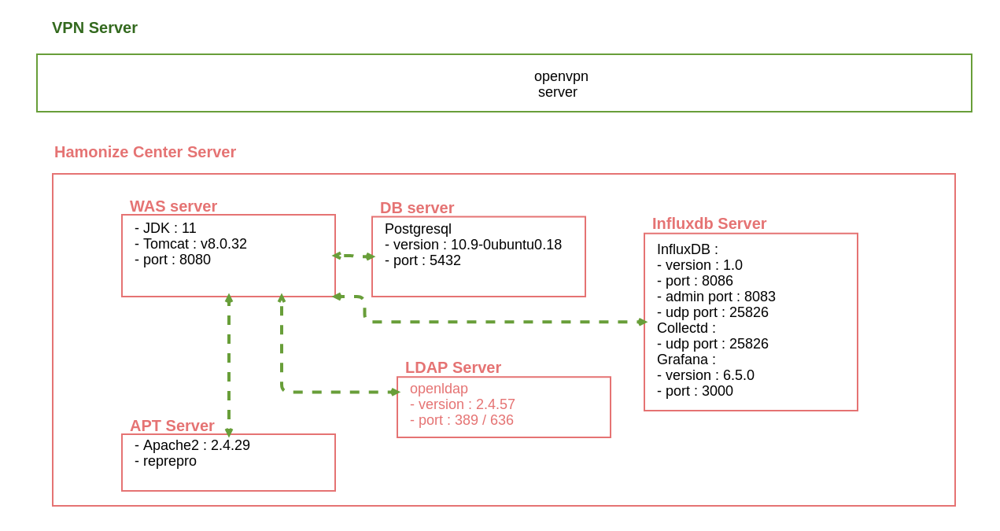
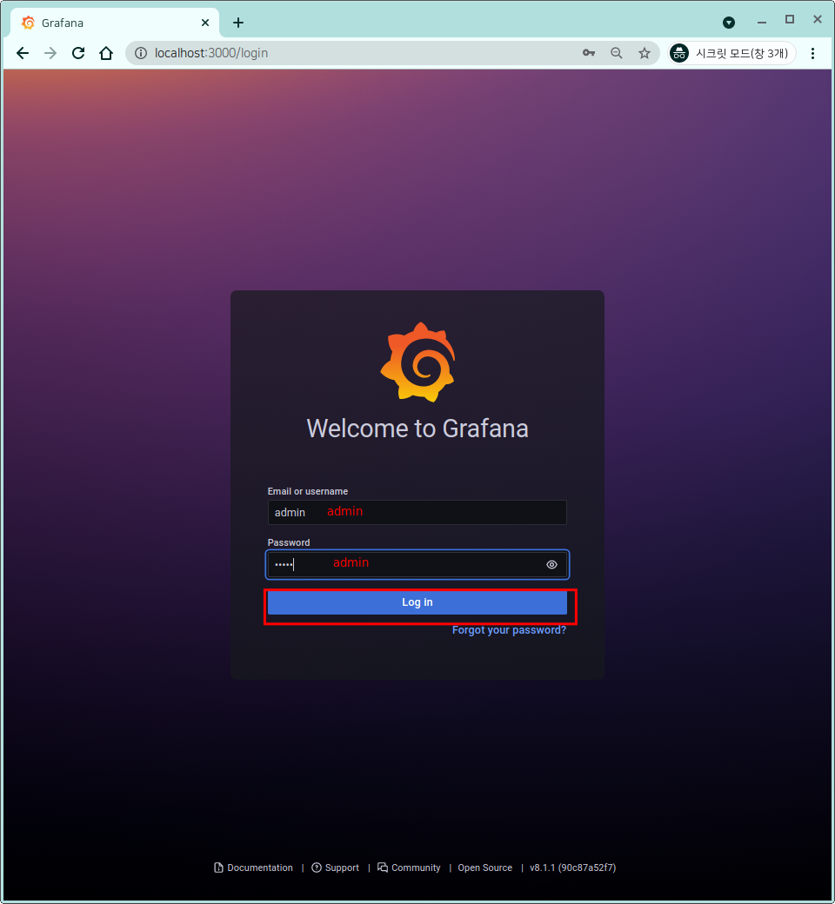
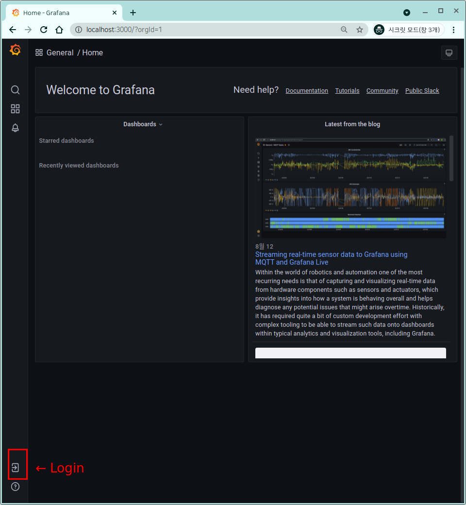
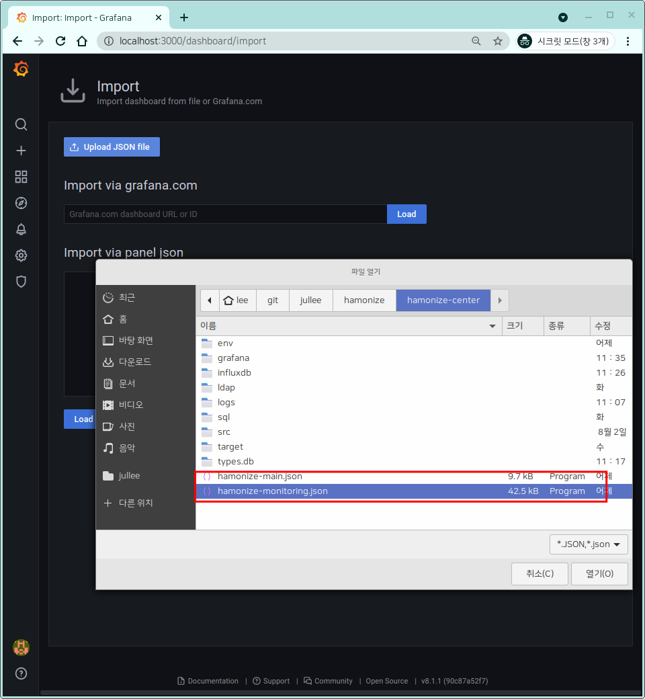
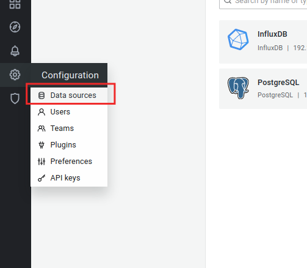
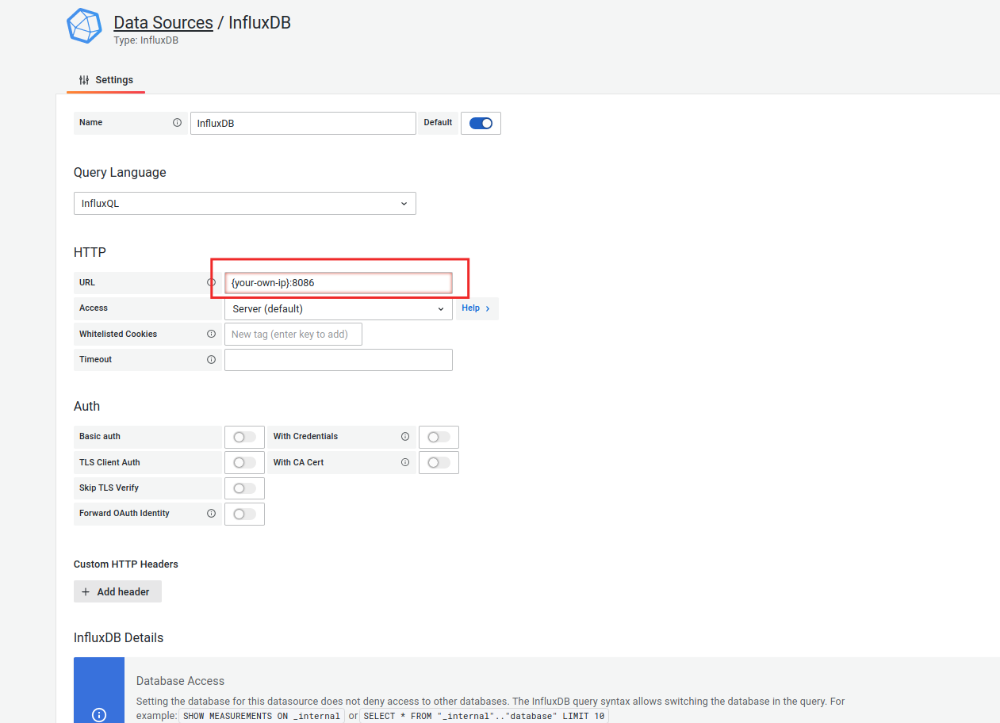
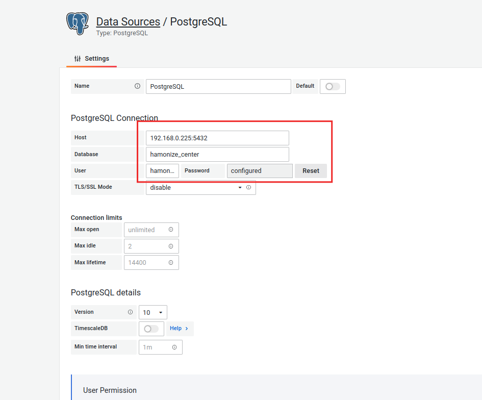
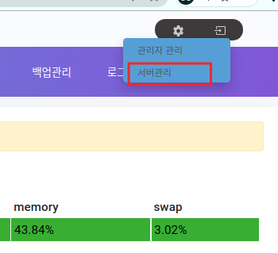
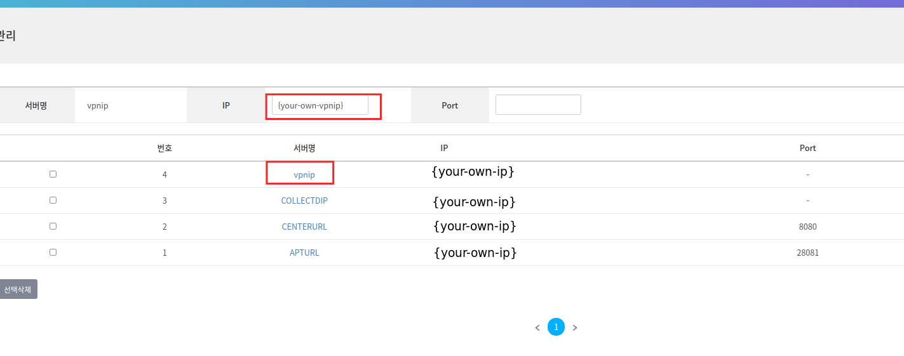

# Hamonize-center


### Hamonize-center?

하모나이즈 센터는 원격지의 PC들을 통합적으로 관리 할 수있는 중앙관제 웹서비스입니다.
<br><br>조직과 소속된 자원을 효율적으로 관리해주는 ldap 디렉토리 서버, pc의 자원과 실시간 모니터링을 위한 influx+grafana 서버, 프로그램 관리를 위한 apt서버, 데이터 저장을 위한 db 서버들과 연동된 유기적인 서비스입니다. 또한 각각의 서버들은 vpn망을 통해 통신하여 높은 보안성을 유지하고 있습니다.<br><br>따라서 하모나이즈 센터를 사용하기 위해서는 각각의 서버들을 구축해야합니다. <br> 센터에서는 위의 서버들을 손쉽게 구성할 수 있도록 도커라이징 기능도 같이 제공하고있습니다

<br>
-  하모나이즈 서버 구성도 <br><br> 
<br><br>

-<b> [Hamonize-center](http://ts.hamonikr.org/) 데모 </b>

센터 기능이 궁금하시면 [여기](http://pms.invesume.com:8090/pages/viewpage.action?pageId=73339504#id-%ED%95%98%EB%AA%A8%EB%82%98%EC%9D%B4%EC%A6%88(Hamonize)%EC%82%AC%EC%9A%A9%EC%9E%90%EB%A7%A4%EB%89%B4%EC%96%BC-%ED%95%98%EB%AA%A8%EB%82%98%EC%9D%B4%EC%A6%88%EC%84%BC%ED%84%B0%EC%A0%91%EC%86%8D%ED%95%98%EA%B8%B0)를 참고하세요
   
<br><br>

# <b>Hamonize-center 설치</b>

### 1 단계 : 소스 빌드하기<br>

### 2 단계 : 서버 구성하기<br>

### 3 단계 : 실행하기 <br>

<br><br>

## **1 단계 : 소스 빌드하기**<br>

1. 소스받기 <br>
   현재/최신 릴리스는 항상 [깃헙 소스저장소](https://github.com/hamonikr/hamonize)에서 페이지 에서 찾을 수 있습니다.

   ```
    git clone https://github.com/hamonikr/hamonize.git
   ```

<br><br>

2. 소스 빌드하기 <br><br> <br>  hamonize-center/ 위치에서 maven build 실행 <br><br>
    ```
      mvn clean && mvn install
    ```
<br><br>

## **2 단계 : 서버 구성하기**<br>

docker-compose.yml 파일은 docker로 was, db, ldap, influxdb 서버등을 도커로 쉽게 구성하기 위해 만들어진 파일입니다. 아래의 설정을 완료해야 도커로 각 서버를 사용할 수 있습니다.  <br><br>

- docker-compose.yml 설정 <br>
  ① **db** 에서 {your own db pw}를 원하는 패스워드로 설정해주세요 <br>
  ② **ldap** 에서  {your own ldap pw} 를 원하는 패스워드로 설정해주세요 <br>
  ③ **ldap** 에서 {your own ldap company} 를 자신이 소속된 조직으로 설정해주세요 <br>

      ```
        version : '3'
        services : 
            db:
                image: postgres:10.16
                environment:
                    POSTGRES_USER : hamonize
                    POSTGRES_PASSWORD : {your own db pw} --- ①
                    POSTGRES_DB : hamonize_center
                ports:
                    - "5432:5432"
                volumes:
                    - ./sql:/docker-entrypoint-initdb.d
                    - psql-data:/var/lib/postgresql/data

            ...

            ldap:
                image: osixia/openldap:latest
                hostname: ldap.hamonize.com        
                ports:            
                    - "389:389"
                    - "636:636"
                environment:
                    HOSTNAME: ldap.hamonize.com
                    LOG_LEVEL: 256
                    LDAP_DOMAIN: hamonize.com
                    LDAP_BASE_DN: dc=hamonize,dc=com
                    LDAP_ADMIN_PASSWORD: {your own ldap pw} --- ②
                    LDAP_ORGANISATION: {your own ldap company}  --- ③
                volumes:
                    - ldap-data:/var/lib/openldap
                    - ./ldap/config:/etc/openldap/slapd.d              
                domainname: "ldap.hamonize.com"
                restart: always

            ...

      ```


    <br>
      
    config.propertis 파일은 센터에서 각서버의 연결정보를 가져오는 설정파일입니다. 기본적으로 home/{user}/ 디렉토리에 위치하고있습니다. <br> <br>

- env/config.propertis 설정 <br>
  ① **docker-compose** 에서 설정한 **db password**를 입력해주세요 <br>
  ② **docker-compose** 에서 설정한 **ldap password**를 입력해주세요 <br>     

    ```
      ## PostgreSQL
      spring.db1.datasource.primary.jndi-name=jdbc/postgresqldb
      spring.db1.datasource.driverClassName=org.postgresql.Driver
      # 10.8.0.5 is example vpn ip
      spring.db1.datasource.url=jdbc:postgresql://db:5432/hamonize_center
      # default db admin user
      spring.db1.datasource.username=hamonize
      spring.db1.datasource.password={your own db password} --- ①

      ## ldap 
      ldap.urls=ldap://ldap:389
      ldap.password={your own ldap password} --- ②

      ...

    ```

    <br><br>

-  **influxdb 설정하기** <br>
   grafana/ 권한 변경
    ```
      sudo chown -R grafana/
    ```
  
  <br><br>
    
 - **docker-compose 실행** <br><br>  &nbsp;&nbsp;  <br>
   
   - 실행
      ```
        # hamonize-cener/ 위치에서
        docker-compose up

        # 실행중인 컨테이너 확인
        docker-compose ps

        # 서버 전체 다운
        docker-compose down  

        # 볼륨까지 지울때 
        docker-compose down -v 

      ```

   - volume 위치 : /var/lib/docker/volumes/
     * tomcat log : hamonize-center_was-logs/_data/
     * postsql data : hamonize-center_psql-data/
     * ldap data : hamonize-center_ldap-data/
     * influxdb data : hamonize-center_influxdb/
     * grafana data : hamonize-center_grafana/
   
   <br>

   - 로그 확인하기
       ```
       docker-compose logs -f {container-id} 
       ```

   <br>

   - vpn server 구축하기
vpn 서버 구축 하기는 [여기](https://github.com/hamonikr/hamonize/tree/master/hamonize-server/vpn) 를 참고하세요  

<br><br>

## **3 단계 : 실행하기**<br>
- grafana : http://localhost:3000 <br> * default id/pw : admin / admin
  <br>1) grafana dashboard 설정파일을 제공하고있습니다. 각 파일들을 import 해주세요 - hamonize-main.json, hamonize-monitoring.json <br> <br>
      &nbsp;&nbsp;&nbsp;   &nbsp;&nbsp;&nbsp;  
    <br><br> 2) :gear: > Configuration > datasources 에서 `Add data source` 를 클릭해 
    - InfluxDB  <br>  &nbsp;&nbsp;&nbsp;   <br><br>
    - PostgreSQL <br><br>  
    
    <br> 를 추가해주세요. 서비스가 실행된 자신의 {your-own-ip}와 docker-compose.yml 파일에서 설정한 대로 입력해주세요
    <br><br> 3) default datasources는 influxdb로 설정해주세요
  
<br>

- 하모나이즈 센터 : http://localhost:8080 <br> \* **default id/pw : admin / admin** <br><br> 
  <br>
  <br>
    - 도커로 생성한 서버들을 센터 및 클라이언트 pc에서 사용할 수 있도록 설정을 해주세요 <br> <br>  
    - vpn을 서버를 생성한 경우 vpn 서버의 ip를 입력해주세요. vpn을 사용하지 않는 경우 이 과정은 생략하시면 됩니다. <br> <br>
  <br>

  
<br>
<br>

# 참여하기

## hamonize-center issue

- #### :boom: [bug](https://github.com/hamonikr/hamonize/issues?q=label%3Abug+milestone%3A%22Hamonize-Center%28%EC%A4%91%EC%95%99%EA%B4%80%EB%A6%AC%EC%84%BC%ED%84%B0%29+%EC%A3%BC%EC%9A%94+%EA%B8%B0%EB%8A%A5+%EA%B0%9C%EB%B0%9C%22)
- #### :sparkles: [to-do](https://github.com/hamonikr/hamonize/issues?q=label%3A%22todo+%3Aspiral_notepad%3A%22+milestone%3A%22Hamonize-Center%28%EC%A4%91%EC%95%99%EA%B4%80%EB%A6%AC%EC%84%BC%ED%84%B0%29+%EC%A3%BC%EC%9A%94+%EA%B8%B0%EB%8A%A5+%EA%B0%9C%EB%B0%9C%22)
- #### :seedling: [good first issue](https://github.com/hamonikr/hamonize/issues?q=label%3A%22good+first+issue%22+milestone%3A%22Hamonize-Center%28%EC%A4%91%EC%95%99%EA%B4%80%EB%A6%AC%EC%84%BC%ED%84%B0%29+%EC%A3%BC%EC%9A%94+%EA%B8%B0%EB%8A%A5+%EA%B0%9C%EB%B0%9C%22)

<br>

## **code-style**
hamonize-center 프로젝트는 [Google Java Style](https://google.github.io/styleguide/javaguide.html) 을 준수하고 있습니다.<br> 개발환경에 맞게 코드 스타일을 적용해주세요.<br> 아래는 예시입니다.

- vscode : setting.json 파일에 아래의 내용을 추가해주세요
  <br>

   ```
  "java.format.settings.url": "https://raw.githubusercontent.com/google/styleguide/gh-pages/eclipse-java-google-style.xml",
  "java.format.settings.profile": "GoogleStyle",
  "editor.formatOnSave": true  // 소스 저장시 바로 코드스타일 적용되는 옵션

  ...

   ```

- Eclipse : https://github.com/google/styleguide/blob/gh-pages/eclipse-java-google-style.xml 에서 eclipse-java-google-style.xml 파일을 다운받아서
  <br>1) Window > Preferences > Java > Code Style > Formatter > Formatter
  <br>2) Import > eclipse-java-google-style.xml 선택 후 적용
