# Hamonize-center
하모나이즈 센터는 원격지의 PC들을 통합적으로 관리 할 수있는 중앙관제 웹서비스입니다.
<br>

<b> [Hamonize-center](http://ts.hamonikr.org/) 데모 </b>

<br>

# <b>Hamonize-center 기능</b>
- 모니터링 서비스 <br>하모나이즈 센터의 모니터링 페이지는 다음과 같은 기능을 제공합니다.
<br> 조직 내 PC의 하드웨어 정보, IP주소 등 세부 정보와 실시간 사용 정보를 확인하는 모니터링 서비스<br> 조직 내 PC에 접속해 원격으로 제어, 관리하는 원격제어 서비스 <br><br> 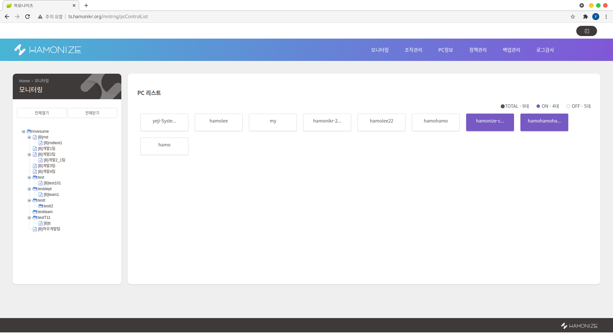 &nbsp;&nbsp;&nbsp;&nbsp;&nbsp; 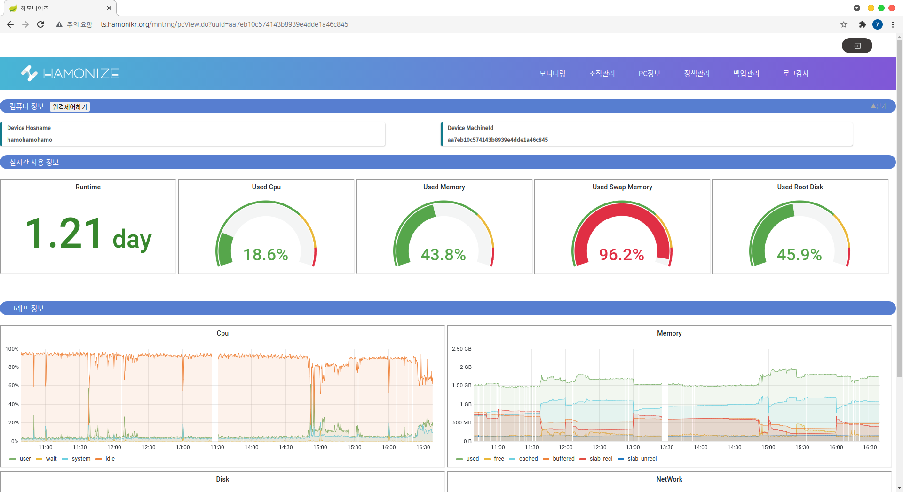 
<br><br>

- 조직관리 <br>하모나이즈 센터의 모든 중앙 관리 서비스는 조직의 구조를 기반으로 이뤄지고, 관리자는 조직관리 페이지를 통해 직접 조직의 구조를 구성할 수 있습니다. <br> <br>
 
<br><br>


- PC 정보 <br>모든 하모나이즈 사용자 PC는 조직 구조를 기반으로 관리되고, 관리자는 PC정보 페이지를 통해 조직 내 PC 정보를 확인할 수 있습니다. <br><br> 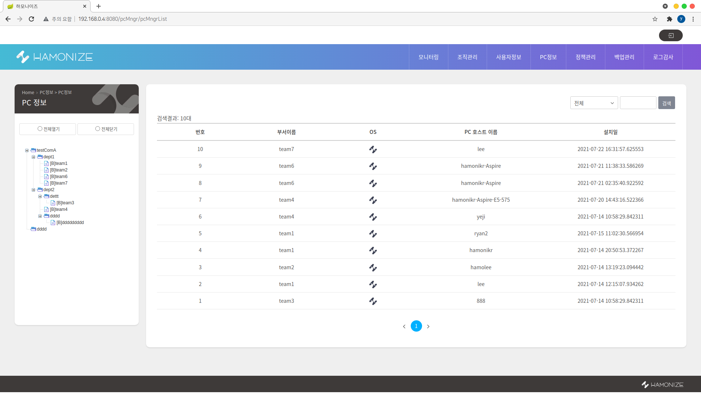 &nbsp;&nbsp;&nbsp;&nbsp;&nbsp; 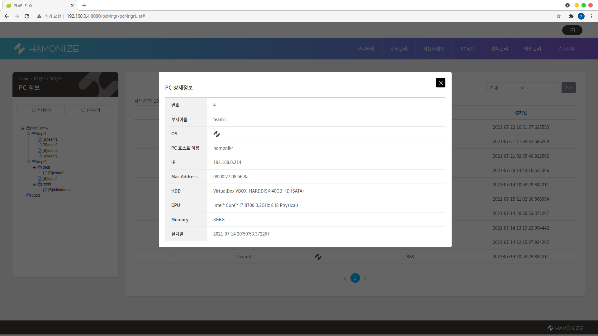 

<br><br>


- 정책관리 <br> 하모나이즈 센터의 정책관리 서비스를 통해 관리자는 조직 내 PC들을 대상으로 프로그램을 업데이트, 특정 프로그램 차단, 방화벽 관리, 그리고 디바이스 관리를 할 수 있습니다.
    * **업데이트 관리** : 업데이트 관리 서비스를 통해 관리자는 조직 내 PC들을 대상으로 특정 프로그램을 설치, 업데이트, 또는 삭제할 수 있습니다. <br><br>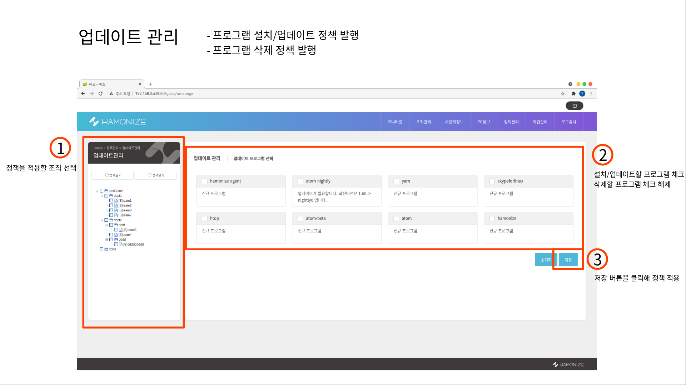 

    * **프로그램 관리** : 정책관리의 업데이트관리 메뉴를 통해 설치/업데이트한 프로그램은 프로그램관리 메뉴를 통해 차단 또는 허용할 수 있습니다. <br><br>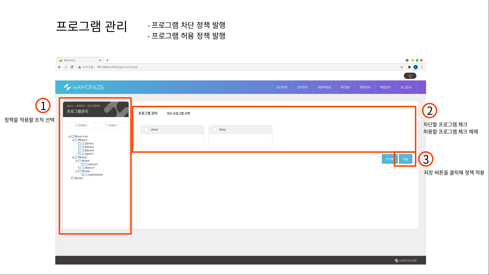

    * **방화벽 관리** : 하모나이즈가 설치된 모든 PC는 방화벽 시스템이 설치, 활성화된 상태이고, 하모나이즈 센터의 방화벽 관리 서비스를 통해 조직 내 PC의 방화벽 접근 제어 목록을 관리할 수 있습니다. <br><br>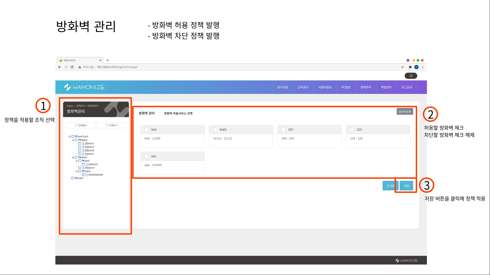

    * **디바이스 관리** : 하모나이즈가 설치된 PC는 기본적으로 모든 USB의 사용이 차단된 상태이므로 센터에서 허용할 수 있는 USB 디바이스를 관리할 수 있습니다. <br><br>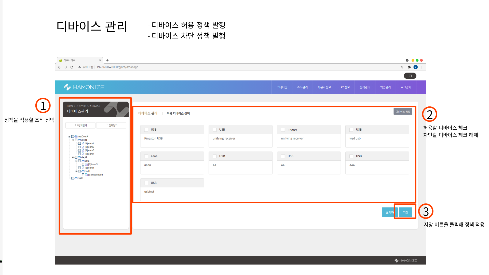


<br>

- 백업관리 : 하모나이즈 센터의 백업관리 서비스를 통해 관리자는 조직 내 PC들의 백업 스케줄을 관리하고, 생성된 백업을 통한 복구를 수행할 수 있습니다. <br><br> 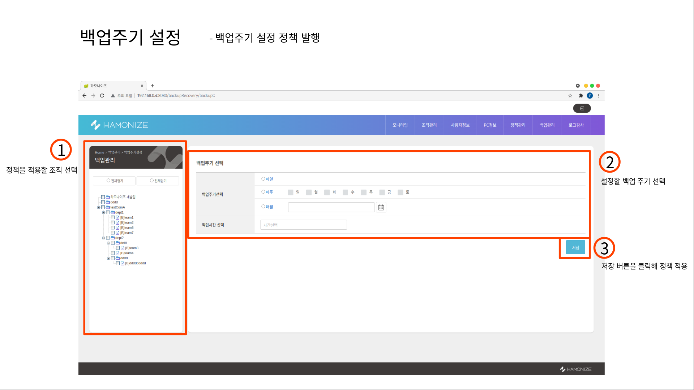 &nbsp;&nbsp;&nbsp;&nbsp;&nbsp; 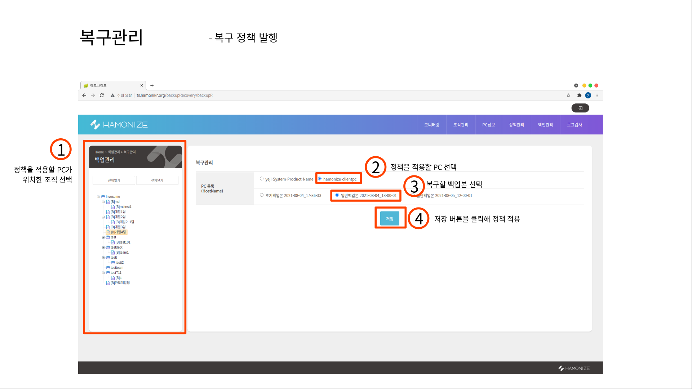 

<br><br>

- 로그감사 : 하모나이즈는 조직 내 PC의 사용자 접속로그, 프로세스 차단로그, 하드웨어 변경로그, 그리고 비인가 디바이스 로그 감사 기능을 제공합니다.
  * 사용자 접속로그 : 관리자는 사용자 접속로그 페이지를 통해 조직 내 PC의 전원이 켜진 시점, 전원이 꺼진 시점, 그리고 PC 사용 시간을 확인할 수 있습니다.  <br><br> 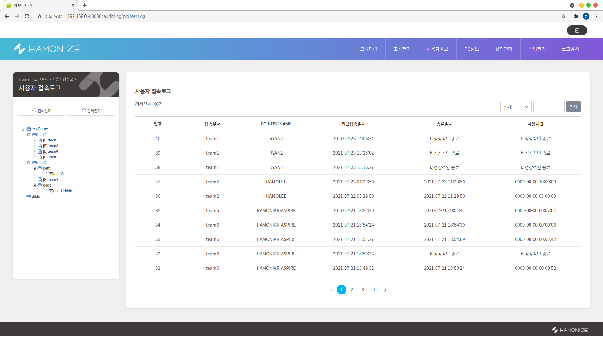
  * 프로세스 차단로그 : 관리자가 정책관리 하위의 프로그램관리 메뉴를 통해 특정 프로그램의 차단 정책을 배포한 후, 정책이 적용된 조직 내 PC에서 해당 프로그램의 실행을 시도하면 프로세스가 차단된 것을 확인할 수 있습니다. <br><br> 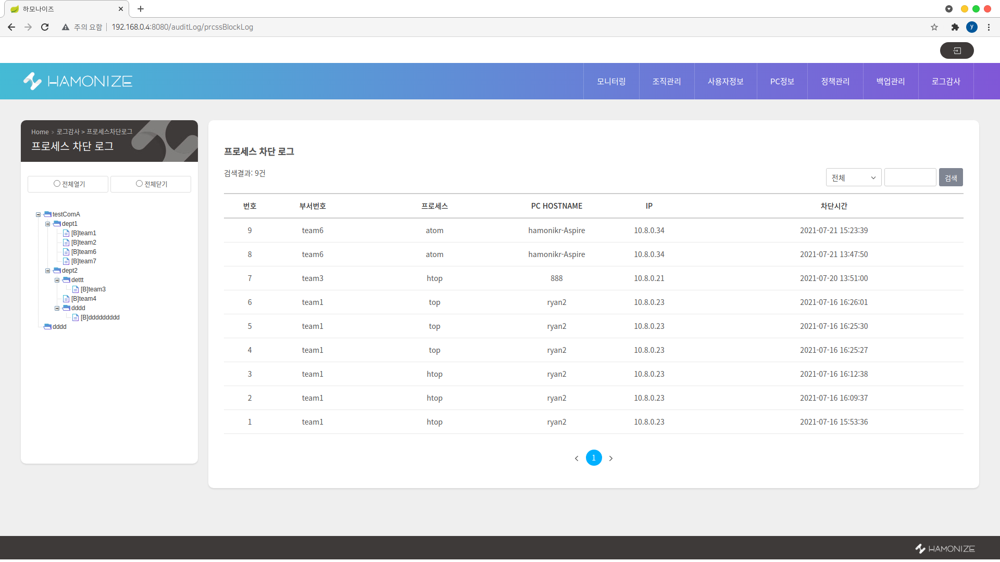
  * 하드웨어 변경로그 : 상단 메뉴의 로그감사 하위의 하드웨어 변경로그 페이지는 조직 내 PC에서 발생한 하드웨어 변경 로그를 출력합니다.  <br><br> 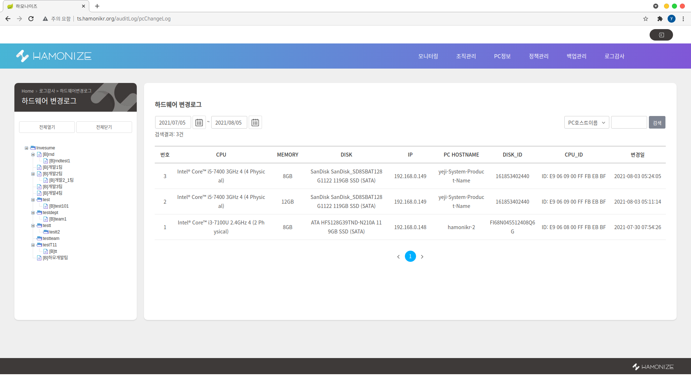
  * 비인가 디바이스로그 : 하모나이즈가 설치된 PC는 기본적으로 모든 USB가 차단 상태이고, 관리자는 정책관리 하위의 디바이스 관리 메뉴를 통해 특정 디바이스의 허용 또는 차단 정책을 배포할 수 있습니다. <br><br> 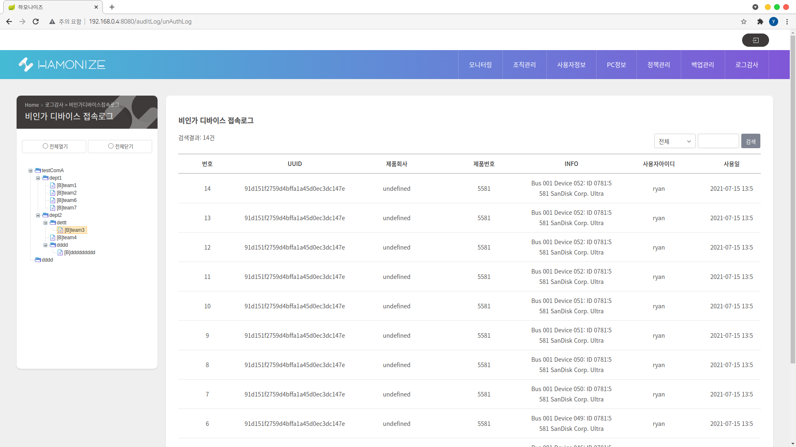
  * 정책 배포 결과 : 관리자가 정책관리 메뉴를 통해 수행한 정책 배포의 결과를 정책 배포 결과 페이지에서 확인할 수 있습니다. <br><br> 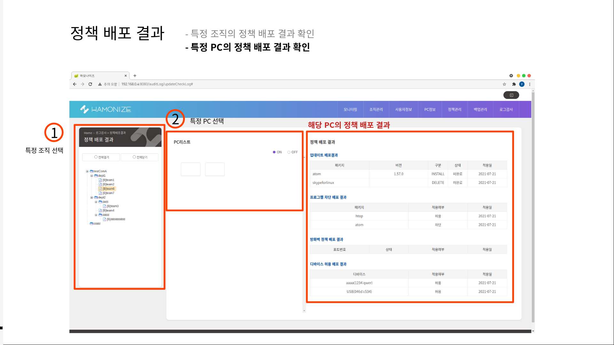

<br><br> 


# <b>Hamonize-center 설치</b>

### 1 단계 : 소스 빌드하기<br>
### 2 단계 : 개발 환경 구성하기<br>
### 3 단계 : 실행하기  <br>

<br><br>


## **1 단계 : 소스 빌드하기**<br>
 
1. 소스받기 <br>
 현재/최신 릴리스는 항상 [깃헙 소스저장소](https://github.com/hamonikr/hamonize)에서 페이지 에서 찾을 수 있습니다. 
```
 git clone https://github.com/hamonikr/hamonize.git 
```

<br><br>

2. 소스 빌드하기 <br>
- Apache Maven 3.6.3  <br>
  
  hamonize-center/ 위치에서 maven build 실행

  ```
   mvn clean && mvn install
  ``` 


<br><br>


3) 실행화면 <br>
- 하모나이즈 센터 : http://localhost:8080 <br> * **default id/pw : admin / admin** <br><br> 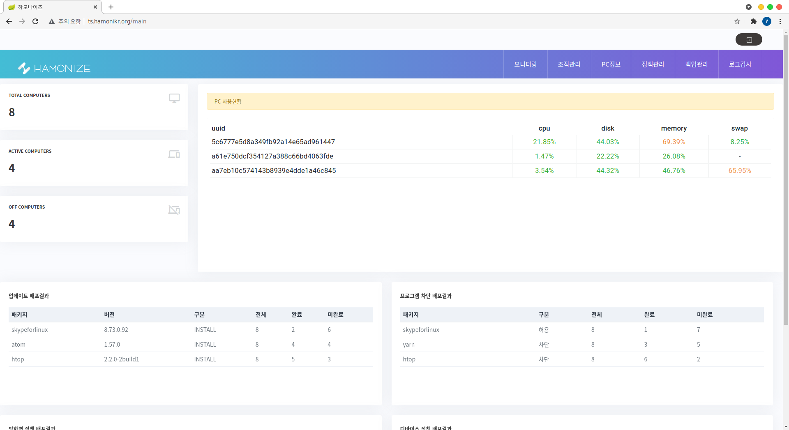

<br><br>


# 참여하기

## hamonize-center issue
 - #### :boom: [bug](https://github.com/hamonikr/hamonize/issues?q=label%3Abug+milestone%3A%22Hamonize-Center%28%EC%A4%91%EC%95%99%EA%B4%80%EB%A6%AC%EC%84%BC%ED%84%B0%29+%EC%A3%BC%EC%9A%94+%EA%B8%B0%EB%8A%A5+%EA%B0%9C%EB%B0%9C%22) 
 - #### :sparkles: [to-do](https://github.com/hamonikr/hamonize/issues?q=label%3A%22todo+%3Aspiral_notepad%3A%22+milestone%3A%22Hamonize-Center%28%EC%A4%91%EC%95%99%EA%B4%80%EB%A6%AC%EC%84%BC%ED%84%B0%29+%EC%A3%BC%EC%9A%94+%EA%B8%B0%EB%8A%A5+%EA%B0%9C%EB%B0%9C%22)
 - #### :seedling: [good first issue](https://github.com/hamonikr/hamonize/issues?q=label%3A%22good+first+issue%22+milestone%3A%22Hamonize-Center%28%EC%A4%91%EC%95%99%EA%B4%80%EB%A6%AC%EC%84%BC%ED%84%B0%29+%EC%A3%BC%EC%9A%94+%EA%B8%B0%EB%8A%A5+%EA%B0%9C%EB%B0%9C%22)


## **code-style** 
<br>hamonize-center 프로젝트는 google-java-format 을 준수하고 있습니다.<br>
개발환경에 맞게 코드 스타일을 적용해주세요.<br> 아래는 예시입니다.
  - vscode : setting.json 파일에 아래의 내용을 추가해주세요 
  <br>
  
  ```
   "java.format.settings.url": "https://raw.githubusercontent.com/google/styleguide/gh-pages/eclipse-java-google-style.xml",
   "java.format.settings.profile": "GoogleStyle",
   "editor.formatOnSave": true  // 소스 저장시 바로 코드스타일 적용되는 옵션 

   ...

  ```
  - Eclipse : https://github.com/google/styleguide/blob/gh-pages/eclipse-java-google-style.xml 에서 eclipse-java-google-style.xml 파일을 다운받아서 
  <br>1) Window > Preferences > Java > Code Style > Formatter > Formatter 
  <br>2) Import > eclipse-java-google-style.xml 선택 후 적용


