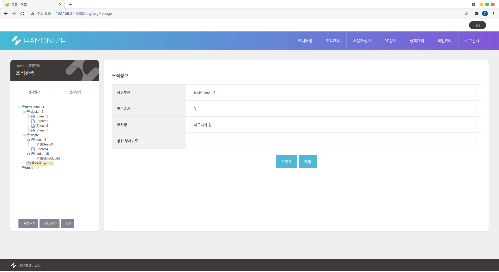

# Hamonize-center


### Hamonize-center?

하모나이즈 센터는 원격지의 PC들을 통합적으로 관리 할 수있는 중앙관제 웹서비스입니다
<br>

<b> [Hamonize-center](http://ts.hamonikr.org/) 데모 </b>

# <b>Hamonize-center 기능</b>

- 모니터링 서비스 <br>하모나이즈 센터에서는 조직 내 PC의 실시간 사용 정보와 조직 내 PC를 원격제어할 수 있는  서비스를 제공하고 있습니다 <br><br>  &nbsp;&nbsp;&nbsp;&nbsp;&nbsp; 
  <br><br>

- 조직관리 <br>하모나이즈 센터의 모든 중앙 관리 서비스는 조직의 구조를 기반으로 이뤄지고, 관리자는 조직관리 페이지를 통해 직접 조직의 구조를 구성할 수 있습니다. <br> <br>
  
  <br><br>

- PC 정보 <br>모든 하모나이즈 사용자 PC는 조직 구조를 기반으로 관리되고, 관리자는 PC정보 페이지를 통해 조직 내 PC 정보를 확인할 수 있습니다. <br><br>  &nbsp;&nbsp;&nbsp;&nbsp;&nbsp; 

<br><br>

- 정책관리 <br> 하모나이즈 센터의 정책관리 서비스를 통해 관리자는 조직 내 PC들을 대상으로 프로그램을 업데이트, 특정 프로그램 차단, 방화벽 관리, 그리고 디바이스 관리를 할 수 있습니다.

  <br>

<br>

- 백업관리 <br>하모나이즈 센터의 백업관리 서비스를 통해 관리자는 조직 내 PC들의 백업 스케줄을 관리하고, 생성된 백업을 통한 복구를 수행할 수 있습니다. <br><br>  &nbsp;&nbsp;&nbsp;&nbsp;&nbsp; 

<br><br>

- 로그감사 <br> 하모나이즈는 조직 내 PC의 사용자 접속로그, 프로세스 차단로그, 하드웨어 변경로그, 그리고 비인가 디바이스 로그 감사 기능을 제공합니다.
 <br><br> 

더 자세한 내용은 [사용자 매뉴얼](http://pms.invesume.com:8090/pages/viewpage.action?pageId=73339504) 을 참고하세요

<br><br>

# <b>Hamonize-center 설치</b>

### 1 단계 : 소스 빌드하기<br>

### 2 단계 : 서버 구성하기<br>

### 3 단계 : 실행하기 <br>

<br><br>

## **1 단계 : 소스 빌드하기**<br>

1. 소스받기 <br>
   현재/최신 릴리스는 항상 [깃헙 소스저장소](https://github.com/hamonikr/hamonize)에서 페이지 에서 찾을 수 있습니다.

   ```
    git clone https://github.com/hamonikr/hamonize.git
   ```

<br><br>

2. 소스 빌드하기 <br><br> <br>  hamonize-center/ 위치에서 maven build 실행 <br><br>
    ```
      mvn clean && mvn install
    ```
<br><br>

## 2 단계 : 서버 구성하기<br>
-  하모나이즈 센터 서버 구성도 <br><br> 
<br><br>하모나이즈 센터는 조직과 소속된 자원을 효율적으로 관리해주는 디렉토리 서버, pc의 자원과 실시간 모니터링을 위한 influx+grafana 서버, 프로그램 관리를 위한 apt서버, 데이터 저장을 위한 db 서버들과 연동된 웹서비스입니다. 또한 각각의 서버들은 vpn망을 통해 통신하여 높은 보안성을 유지하고 있습니다.<br><br>따라서 하모나이즈 센터를 사용하기 위해서는 각각의 서버들을 구축해야합니다. <br> 센터에서는 위의 서버들을 손쉽게 구성할 수 있도록 도커라이징 기능도 같이 제공하고있습니다

- vpn server 구축하기
  vpn 서버 구축 하기는 [여기](https://github.com/hamonikr/hamonize/tree/master/hamonize-server/vpn) 를 참고하세요  

- 센터 서버들 구축하기
  - **DB 서버 구성하기** <br>1) docker-compose.yml 파일 설정<br>
먼저, /hamonize-center/Dockerfile 에서 database의 password를 
원하는 패스워드로 설정해주세요

    ```

      version : '3'
      services : 
          db:
              image: postgres:10.16
              environment:
                  POSTGRES_USER : hamonize
                  POSTGRES_PASSWORD : {your own db pw}     
              ...

      ```
      <br>
      2) env > config.propertis 설정
      <br>
      /hamonize-center/env/config.propertis 에 1) 에서 설정한 database password를 입력해주세요

      ```
      ...

      # default db admin user
      spring.db1.datasource.username=hamonize
      spring.db1.datasource.password={your own db pw}
      ```
      <br><br>
   -  **LDAP 서버 구성하기**
      1) docker-compose.yml 파일 설정<br>
          첫번째로, /hamonize-center/Dockerfile 에서 ldap admin user의 password를 원하는 패스워드로 설정해주세요<br>그리고 LDAP_ORGANISATION 에 본인의 소속된 조직의 명칭을 입력해주세요

          ```

             ...
              LDAP_DOMAIN: hamonize.com
              LDAP_BASE_DN: dc=hamonize,dc=com
              LDAP_ADMIN_PASSWORD: {your own ldap pw}
              LDAP_ORGANISATION: {your own ldap company} 
          
              ...

          ```

          <br>
      2) env > config.propertis 설정
         <br>

         /hamonize-center/env/config.propertis 에 1. 에서 설정한 ldap password를 입력해주세요

         ```
         ...

         ## ldap 
         ldap.urls=ldap://ldap:389
         ldap.password={your own ldap pw}
         ...

         ```

         <br><br>
     -  **influxdb 서버 구성하기** <br>
       grafana/ 권한 변경
          ```
            sudo chown -R grafana/
          ```
   

    <br><br>
    
    - **docker-compose 실행** <br><br>  &nbsp;&nbsp;  <br>
      
      - 실행
      ```
       # hamonize-cener/ 위치에서
       docker-compose up

        # 실행중인 컨테이너 확인
       docker-compose ps

      ```
      <br><br>

      - 종료
      ```
       docker-compose down  

       # 볼륨까지 지울때 
       docker-compose down -v 

      ```
      <br>

      - volume 위치 : /var/lib/docker/volumes/
        * tomcat log : hamonize-center_was-logs/_data/
        * postsql data : hamonize-center_psql-data/
        * ldap data : hamonize-center_ldap-data/
        * influxdb data : hamonize-center_influxdb/
        * grafana data : hamonize-center_grafana/
      
      <br>

      - 로그 확인하기
          ```
          docker-compose logs -f
          ```
<br><br>

## **3 단계 : 실행하기**<br>
- grafana : http://localhost:3000 <br> * default id/pw : admin / admin
  <br> grafana dashboard 설정파일을 제공하고있습니다. import 해주세요 - hamonize-main.json, hamonize-monitoring.json 


- 하모나이즈 센터 : http://localhost:8080 <br> \* **default id/pw : admin / admin** <br><br> 
  <br>
  <br>

<br>
<br>

# 참여하기

## hamonize-center issue

- #### :boom: [bug](https://github.com/hamonikr/hamonize/issues?q=label%3Abug+milestone%3A%22Hamonize-Center%28%EC%A4%91%EC%95%99%EA%B4%80%EB%A6%AC%EC%84%BC%ED%84%B0%29+%EC%A3%BC%EC%9A%94+%EA%B8%B0%EB%8A%A5+%EA%B0%9C%EB%B0%9C%22)
- #### :sparkles: [to-do](https://github.com/hamonikr/hamonize/issues?q=label%3A%22todo+%3Aspiral_notepad%3A%22+milestone%3A%22Hamonize-Center%28%EC%A4%91%EC%95%99%EA%B4%80%EB%A6%AC%EC%84%BC%ED%84%B0%29+%EC%A3%BC%EC%9A%94+%EA%B8%B0%EB%8A%A5+%EA%B0%9C%EB%B0%9C%22)
- #### :seedling: [good first issue](https://github.com/hamonikr/hamonize/issues?q=label%3A%22good+first+issue%22+milestone%3A%22Hamonize-Center%28%EC%A4%91%EC%95%99%EA%B4%80%EB%A6%AC%EC%84%BC%ED%84%B0%29+%EC%A3%BC%EC%9A%94+%EA%B8%B0%EB%8A%A5+%EA%B0%9C%EB%B0%9C%22)

<br>

## **code-style**
hamonize-center 프로젝트는 [Google Java Style](https://google.github.io/styleguide/javaguide.html) 을 준수하고 있습니다.<br> 개발환경에 맞게 코드 스타일을 적용해주세요.<br> 아래는 예시입니다.

- vscode : setting.json 파일에 아래의 내용을 추가해주세요
  <br>

   ```
  "java.format.settings.url": "https://raw.githubusercontent.com/google/styleguide/gh-pages/eclipse-java-google-style.xml",
  "java.format.settings.profile": "GoogleStyle",
  "editor.formatOnSave": true  // 소스 저장시 바로 코드스타일 적용되는 옵션

  ...

   ```

- Eclipse : https://github.com/google/styleguide/blob/gh-pages/eclipse-java-google-style.xml 에서 eclipse-java-google-style.xml 파일을 다운받아서
  <br>1) Window > Preferences > Java > Code Style > Formatter > Formatter
  <br>2) Import > eclipse-java-google-style.xml 선택 후 적용
